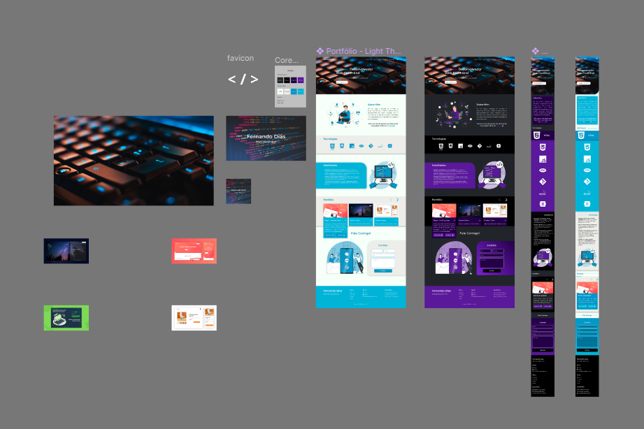

    <h1>Portfólio💻</h1>

## O que é?

Esse é o projeto do meu portfólio pessoal, um site onde deixo visíveis todas as minhas capacitações e tecnologias a qual tenho domínio, além de mostrar alguns dos principais projetos que desenvolvi, mostrando minha experiência como programador Front-End.

## Detalhes

O projeto é estruturado em subdivisões de tópicos. Possuindo uma *navbar*  que permite que o usuário vá com apenas um clique para o tópico a qual ele se interesse. Os tópicos que constituem a *navbar* são:

* **Sobre mim:**  Um resumo rápido e sintetizado de quem sou eu, o que eu faço e experiência.
* **Tecnologias:** Local onde é possível ter uma visualização rápida de todas as tecnologias a qual tenho domínio.
* **Portfólio:** Alguns dos projetos de Front-End que desenvolvi, com a opção de visualizar o projeto ou ir para o repositório remoto do mesmo.
* **Contato:** Área onde o cliente pode entrar em contato comigo, enviando dados como: Nome, E-mail, Telefone e uma mensagem. A mensagem chegará no meu e-mail junto com os respectivos dados para entrar em contato.

> A *navbar* também possuí um botão para mudar o tema para escuro.

Por fim, o rodapé é composto por alguns tópicos, tais como:

* **Menu:** Uma lista de todos os tópicos que também estão na *navbar*.
* **Social:** Uma lista das minhas principais redes sociais e meios onde o usuário também pode estar entrando em contato comigo.
* **Illustrations:** Referência das ilustrações utilizadas no portfólio, pegas da plataforma <a href="https://storyset.com/">Storyset</a>.

## Detalhes técnicos

Nesse projeto foi utilizado além das tecnologias comuns para Front-End, bibliotecas JavaScript que auxiliam na dinâmica da página.

### Tecnologias

As tecnologias utilizadas nesse projeto foram:

* **HTML:** Estruturação do conteúdo na página.
* **CSS:** Estilização da página e responsividade para compatibilidade com diversos dispositivos.
* **JavaScript:** Linguagem de programação utilizada para tornar a página dinâmica.

### Bibliotecas utilizadas

Foram utilizadas as seguintes bibliotecas de JavaScript na aplicação:

* <a href="https://micku7zu.github.io/vanilla-tilt.js/">Vanila Tilt</a> - Para o efeito 3D do botão de baixar o currículo.
* <a href="https://mattboldt.com/demos/typed-js/">Typed JS</a> - Para o efeito de digitação das frases presentes na visualização inicial.
* <a href="https://swiperjs.com/">Swiper</a> - Para o efeito de touch presente no tópico de portfólio (melhor visualizado na tela de celulares).
* <a href="https://scrollrevealjs.org/">Scrollreveal</a> - Para o efeito de revelação quando girado o scroll do mouse na visualização de computador.

### Layout e design

O design foi pré desenhado antecipadamente no programa Figma. Tanto as telas para dispositivos mobiles quanto para computadores. Juntamente, a paleta de cores também de ante-mão foi pré selecionada.

> É possível visualizar o protótipo <a href="https://www.figma.com/file/RO6ynTAUqdcxRoECj9JWX6/Portf%C3%B3lio?type=design&node-id=0%3A1&mode=design&t=0ukEeLBnWgBNEZNJ-1">aqui</a>. Veja também o <a href="https://fernandodiasdev.netlify.app">resultado</a>.